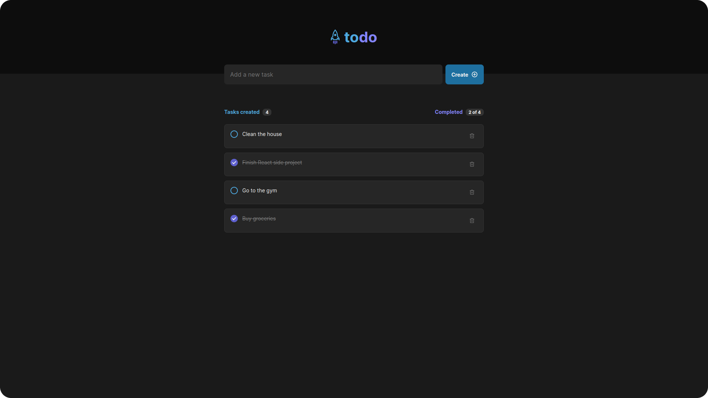

  <h1>React ToDo</h1>

## About
React ToDo is a simple to-do application created with React. The goal of this application is to practice my skills with React and CSS.

## Layout
The layout of the application is [here](https://www.figma.com/file/plgF3P4WiKhzMKq750Ynq5/ToDo-List?node-id=0%3A1&t=4dmjSYY1liwMOT7C-1).

## Usage
To run the project you can follow these steps:
- Clone the project with `git clone https://github.com/Eduardo-H/todo-react.git`
- Navigate into the project's folder `cd todo-react/`
- Use the command `yarn` to install all the dependencies
- Run the project with `yarn dev`